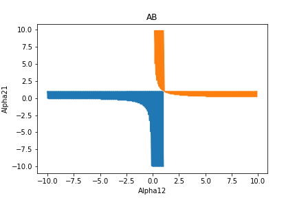

  <h1>Dynamics of the Tumor-Host Interactions from a Force-Field Potential</h1>
  

The interactions between malignant cells (u) and normal cells (v) are studied as well as all possible outcomes of the competition between these two populations (u and v).The dynamics of the system u-v is described by using an approach based on Newton’s Second Law of Motion and a force-field potential U from our new parameterized LV model involving equations with only three (3) parameters namely γ, α12 and α21 which simplify the analysis and allows us to make progress in the discussion of our results. Finally, a series of computational simulations are completed to obtain important information about the influence of γ, α12 and α21 the parameters in our model and then recommend some treatment strategies that will result in a favorable outcome.

**Click [here][1] for more information.**

[1]: https://sites.google.com/site/kboetstoragecabinet9/home/Dynamics%20of%20the%20tumor-host%20interactions%20from%20a%20force-field%20potential.pdf
